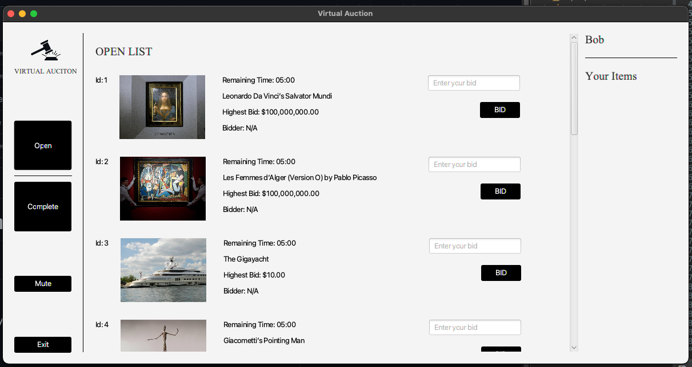

# socket-programming-project

## Tech Stack

Front End: JavaFX(Planning on switching to React)

Backend: Java Socket, MongoDB, Maven

## Demo

## Auction items database
* name (String)
* bid (long)
* id (int)
* bidder (String)
* image (String)
* sold (boolean) 

There are still some bugs :(
